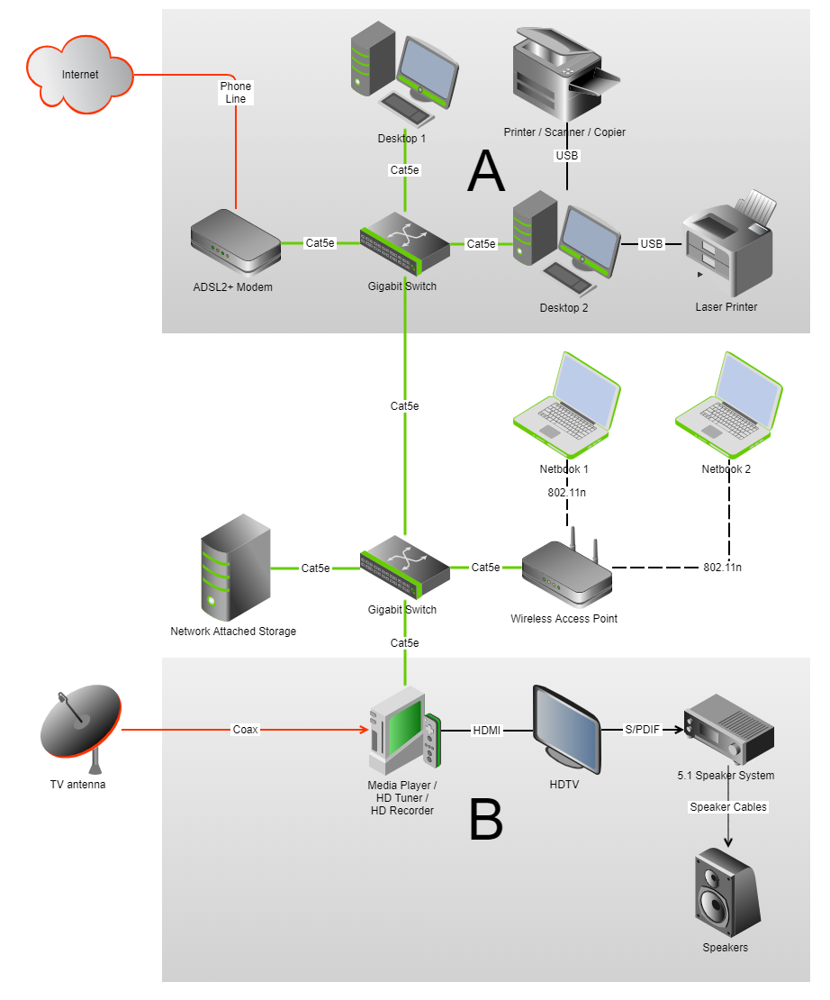

I recently purchased a couple of [gigabit](http://en.wikipedia.org/wiki/Gigabit_Ethernet) [switches](http://en.wikipedia.org/wiki/Network_switch) to run as the ["backbone"](http://en.wikipedia.org/wiki/Backbone_network) of my home network.

Before the new switches I used my ADSL modem and wireless access point as switches. Now the increased speed between devices is outstanding. And since we're studying communication systems in [HSC IPT](https://educationstandards.nsw.edu.au/wps/portal/nesa/11-12/stage-6-learning-areas/technologies/information-processes-technology-syllabus), I thought this would be a good source of classroom discussions.

# The network diagram

Points of discussion could include: [twisted pair](http://en.wikipedia.org/wiki/Twisted_pair), [ADSL](http://en.wikipedia.org/wiki/Adsl), [modems](http://en.wikipedia.org/wiki/Modem), [firewalls](http://en.wikipedia.org/wiki/Firewall_(computing)), [DHCP](http://en.wikipedia.org/wiki/Dynamic_Host_Configuration_Protocol), [IP addresses](http://en.wikipedia.org/wiki/Internet_Protocol), [switches](http://en.wikipedia.org/wiki/Network_switch), [Cat5e](http://en.wikipedia.org/wiki/Cat5e) (and [Cat6](http://en.wikipedia.org/wiki/Cat6)), [USB](http://en.wikipedia.org/wiki/Usb), [wireless access points](http://en.wikipedia.org/wiki/Wireless_access_point), [802.11n](http://en.wikipedia.org/wiki/802.11), [network-attached storage](http://en.wikipedia.org/wiki/Network_attached_storage), [backup strategies](http://en.wikipedia.org/wiki/Backup), [digital TV](http://en.wikipedia.org/wiki/Digital_television), [coaxial cable](http://en.wikipedia.org/wiki/Coaxial_cable), [HDMI](http://en.wikipedia.org/wiki/Hdmi), [fibre optic cable](http://en.wikipedia.org/wiki/Fibre_optic_cable), and [HDTV](http://en.wikipedia.org/wiki/Hdtv) and [surround sound](http://en.wikipedia.org/wiki/Surround_sound) (fitting in with multimedia).

And, of course, the primary reason for the new switches: [transmission speeds](http://en.wikipedia.org/wiki/Transmission_speed).

Here's the network diagram (click to enlarge):

* Green = gigabit capable hardware
* Red = external data sources

The diagram shows how devices are connected, and how data moves around my house. Area A is the library/study where most of the data (and this blog) is created and assembled. Area B is the consumption room, where media is displayed.

The backbone cable between the new gigabit switches runs under the house. The wireless access point sits there too, broadcasting up into the house (through wooden floors) and down into the back garden.

External data is sourced from the internet and TV transmissions. (Radio is also used, but via a non-networked device). Internally, most data is stored and retrieved from the network-attached device (NAS) in Area B, with regular backups of critical data stored on the desktops in Area A.

I'm thinking of moving the NAS to a spot under the house too (to minimise the noise and heat in Area B), but I first need to ensure I can ventilate it and protect it from dust.

I deliberately chose not to include brands, makes, and models in the diagram for two reasons: first, this diagram is just to demonstrate a network structure and it's components, not promote a product; second, the less information I provide about the specifics of my household network devices, the fewer vulnerabilities I expose it to from targetted attacks.

# Creating the network diagram

Previously I've used [Microsoft Publisher](http://en.wikipedia.org/wiki/Microsoft_Publisher) to draw diagrams, but with Office 2007 I couldn't find connectors (they seem to have last appeared in Publisher 2003). So I went looking for a free online solution and found <http://gliffy.com>.

Gliffy is really easy to use, it has great clipart, excellent connectors, and allows for saving (as XML or various image formats) and online viewing. With a free account I can draw and save up to 5 diagrams. If I want more than that I'll think about subscribing. You must have an account to save diagrams, so in a classroom situation students where I don't want to force students to provide personal data to external entities, they could build their diagram and then use screenshots to store them.