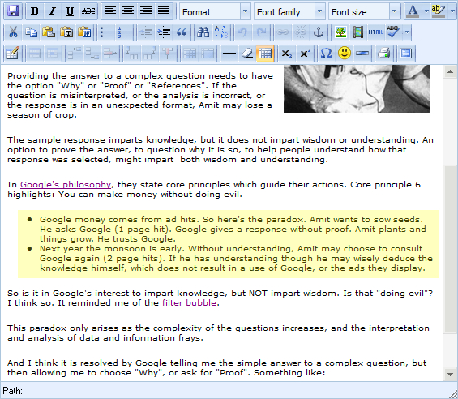
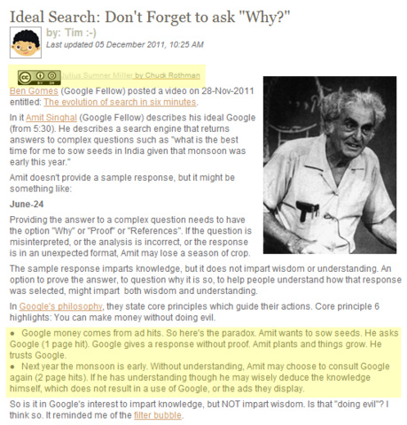
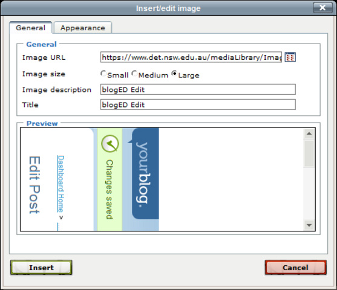
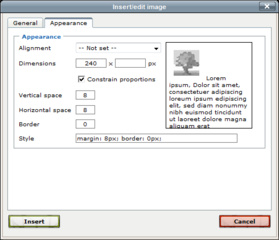
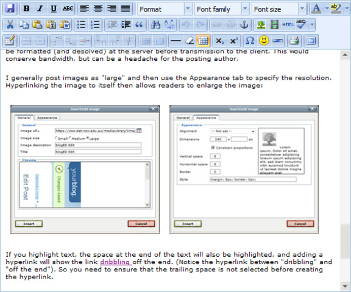

blogED is a blogging environment developed for NSW government school teachers and students. (You're reading one of the blogs right now!) It is a great concept, with some excellent features, but also some foibles, and some uglies.

# Some Good

I fully support and recommend using Department sanctioned software. That way staff and students are familiar with the software and systems from site to site, and resources can be easily shared and centralised.

So as a blogging environment for sharing ideas with colleagues, teaching and learning in the classroom, and distributing information to parents and the community, blogED is a great concept.

One excellent aspect is that it links directly into student portal authentication, and students can easily be grouped to create class blogs, even across multiple sites (if you have a multi-site group). Authorisation is reserved for staff blog owners to check all posts and comments, and the owner of a site can be easily changed if staff move location.

Once a student is added as a blog author it's trivial for them to create a post and then have that authorised and published by their teacher. Then students can share and comment on each others work (and they can consider the copyright and privacy aspects of doing so).

Being able to insert multimedia is great, and these generally format well, and are easy to use.

# Some Bad

One of the limitations of blogED is the look. There are currently only 4 themes to choose from, and customising the appearance of the blog for a student or class is not easy.

The graphic at the head of this blog incorporates an image, with a text overlay. I used colour-matching to merge the header graphic of this blog into the base-colour of one of the four themes, but matching it and aligning for the text overlay was not quick or easy.

Hopefully in blogED 2.0 there will be more simple themes, but maybe also some customisation tools to enable students (and staff) to edit the head/foot and, for power-users, modify [CSS](http://www.w3schools.com/css/).

To insert images you can't link to them, you must upload them to blogED. I'm glad we must include copyright information, and attribute the appropriate source, but I don't understand why we must save a copy of it to the blogED server before it can be used. My best guess is so that the blog will continue to show the image, even if the source server is down.

# Some Ugly

One of key concerns with blogED is that the formatting you see while writing is NOT the formatting of the published post. What You See Is NOT What You Get (WYSINWYG). That's ugly.

You have the option to preview your post, and you really have to, because while you are editing you don't know how it will look when published. Standard HTML tags like [unordered-list](http://www.w3.org/TR/html401/struct/lists.html#h-10.2) are rendered correctly in the inline editor, but not when published. What the?

ABOVE: An unordered-list in the editor (click to enlarge). The editor shows correct indentation of the list, so that the bullet points stand-out.

ABOVE: An unordered-list when published.

There is no indentation and the bullet points to not cleanly separate from the main body of the text. I'm viewing this through Internet Explorer 8 on Windows 7 (using a [DER device](https://en.wikipedia.org/wiki/Digital_Education_Revolution#Laptops)). (Maybe things appear correctly in [Firefox](http://www.mozilla.org/en-US/firefox/) or [Chrome](https://www.google.com/chrome), but those browsers are not supported on the DER devices.)

The above picture also highlights the attribution notice displayed for all images. The image can be aligned to the right, but the notice remains at the position where the image was inserted in HTML. Also, [HTML image alignment](http://www.w3schools.com/tags/att_img_align.asp) seems to break due to the the call of a javascript function (specifically addCopyrightInfoDivsAfterObject in <https://www.det.nsw.edu.au/mediaLibrary/mediabrowser/copyright.js>) which adds objects and code to the published post, but not within the editor. This breaks the formatting between the two views of the same code, and can lead to some unexpected and ugly results. (These methods of image alignment are deprecated, and should be upgraded to use styles.)

And inserting an uploaded image is awkward. The editor allows for resolution selection (the size of the published image), but the user is required to make multiple decisions to determine the best view of the image. I think this is incorporated into blogED for the image to be formatted (and desolved) at the server before transmission to the client. This would conserve bandwidth, but can be a headache for the posting author.

I generally post images as "large" and then use the Appearance tab to specify the resolution. Hyperlinking the image to itself then allows readers to enlarge the image:

If you highlight text, the space at the end of the text will also be highlighted, and adding a hyperlink will show the link [dribbling](http://www.thefreedictionary.com/dribble) off the end. (Notice the hyperlink between "dribbling" and "off the end"). So you need to ensure that the trailing space is not selected before creating the hyperlink.

Bullet-formatting, image uploading and insertion, and WYSINWYG ... all of this means spending twice as much time creating content as expected, half in writing, and half in quirky formatting. That's ugly.

As a case-in-point: the above images were inserted into the editor side-by-side.

Unfortunately, the inclusion of the copyright blurbs breaks that formatting. Possibly we're not expected to use alignment methods, but they are included as part of the editor.

# Nutshell

I love the concept of blogED; an inhouse solution which generally works well, and integrates with departmental authorisation, copyright and privacy. The uglies are only publishing and formatting issues, but they could be the straw on the camels back which prevents some staff and students from sharing.

Maybe [wordpress](http://wordpress.org/) was not an option, but maybe it should be. A customised version to link into with the departments authorisation might be a good solution. Hopefully blogED 2.0 is in the works, and some of these deprecated and inconsistent formatting methods will be revamped.

* If you're a blogED author, what tips and tricks do you use to format content?
* If you're a blogED developer, and need a beta-tester ... :-)