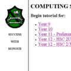
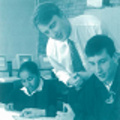
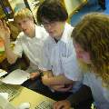
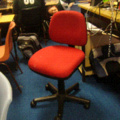
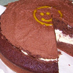
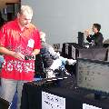

Next year I'll be [transferring](/blog/Nominated-Transfer-Five-Stages-of-Grief/) to another school. With this change I've had cause to pause and consider what I've achieved with my time at my current school; what I've learnt and what I'm proud of. Here's a selection of highlights ...

[Names have been redacted to protect the innocent (and the guilty).]

# Teaching and Learning Achievements

|   |   |   |
|---|---|---|
|  | **Simple Spiderman** Build a basic website to allow an injured soccer player to get class assignments at home Bonus points for [learning javascript](https://www.wired.com/2010/03/welcome-to-the-all-new-webmonkey/) in a weekend | **Unlocked: Mar 16, 1999 1:59pm** Thanks: Robbie S for breaking a leg; Kevin K for the idea; and Col A for trusting me to [play with the school servers](../images/20111212-spiderman_unlocked.jpg) |
|  | **Projector** Contribute to the QTP 3.1 IPT/SDD Project Work [support document](http://books.google.com.au/books/about/Enhancing_project_work_in_SDD_and_IPT.html?id=X5LGAAAACAAJ) Bonus points for meeting some inspiring teachers | **Unlocked: Apr 4, 2001 4:16am** Thanks: Phillip C, Tim G, Steve M, Julie G, Brian S, and John R |
|  | **Whoops** 'Accidentally' motivate students to build a key-logger Bonus points if they successfully build a working prototype; No points if they use it against you to capture the admin password | **Unlocked: Sep 4, 2002 12:36pm*** Thanks: Israel B and Eric L for keeping me on my toes |
|  | **Lord of the Chips** Maintain a stable classroom environment by ensuring all students follow traditional coding eating habits Bonus points for justifying the tradition as natural requirements for all good coders Double bonus points if it's Tuesday | **Unlocked: Aug 27, 2006 1:21pm*** Thanks: Luke C, Alex P, and Basil W (and the chip shop down the road) |
|  | **ProgComp Controller** Promote coding by entering ProgComp several times Bonus points for making it 'mandatory' for all Software Design and Development students | **Unlocked: Jun 16, 2006 3:12pm** Thanks: Josh K, Jay N, and Sam R; [Sam C, Basil W, and Robbie M](../images/20111212-progcomp_controller_2.jpg) (Jun 15, 2007 3:12pm); [Kieran J, Eric L, and Israel B](../images/20111212-teach_me.jpg) (Jun, 2003*) |
|  | **Triple Chairs** Catch a student breaking class rules three times (i.e. swearing) and issue the ultimate punishment at the end of lesson of putting in all classroom chairs ... three times (in-out-in-out-in) Bonus points for students incorporating the word 'Chairs' into their everyday language | **Unlocked: Feb 27, 2007 9:57am*** Thanks: Chris C (nuff said) |
|  | **Let Them Eat Cake** Encourage the bringing and consumption of cake in class Bonus points for a student attempting to elevate teacher happiness while marking homework Double bonus points for a student justifying the cake production as part of original content for an online transaction processing system assessment task | **Unlocked: Jun 28, 2007 1:27pm** Thanks: [Aimie H](../images/20111212-cake_aimie.jpg) and Jordan L (Feb 26, 2010 8:41am) |

# Technology Coordinator Achievements

|   |   |   |
|---|---|---|
|  | **Help Yourself** Build custom software to remove music and movies from student folders ([Trogdor](../images/20111212-trogdor.jpg)), and shutdown/reboot computers site-wide ([netCheat](../images/20111212-netcheat.jpg)) Bonus points for engaging students in a hacker war to defeat the dragon | **Unlocked: Oct 15, 2003 1:24pm** Thanks: Eric L for putting [the cheat](http://www.hrwiki.org/wiki/The_Cheat) in netCheat (Aug 21, 2006 4:10pm) and Sam L and Mel P for building a big [Trogdor web-based version](../images/20111212-trogdor_web_version.jpg) as part of their [Uni course](http://www.scu.edu.au/courses/index.php/3/#information-technology) (May 28, 2007) |
|  | **Teach me; Pay me** Hire an ex-student as an onsite computer technician immediately after graduation | **Unlocked: Feb 4, 2004 9:00am*** Thanks: Eric L (pictured with Kieran J and Israel B) |
|  | **Security Preach** (aka [Right Spin](http://www.grc.com/spinrite.htm)) Hire an onsite computer technician based on his enthusiasm of listening to [Security Now](http://twit.tv/sn) Bonus points for ongoing listening and discussion about technology and security | **Unlocked: Dec 3, 2008 11:23am** Special Thanks: Mickey M sharing knowledge, skills, and pizza |
|  | **Moodle Manic** Jump into [Moodle](http://web1.kadina-h.schools.nsw.edu.au/moodle/) with all your classes, and especially for a [cross-site video-conference class](http://1to1unconf-participant.wikispaces.com/Video+Conferencing+%26+Moodle+for+ICT+IPT+SDD) Bonus points for sharing with other teachers and getting them enthused | **Unlocked: Feb 2, 2010 12:21pm** Thanks: Anne M, Julie B, and Antony M inspiration and support Special Thanks: Paul G, Loreta K, Lynn H, Josh W, and Darren B for showing what is possible |
|  | **Double Supervision** Hire another ex-student as an onsite computer technician immediately after graduation | **Unlocked: Dec 22, 2010 10:56pm** Thanks: Dre W for hacking through problems |
|  | **Unattentive** Meet great people and share great ideas at the [1:1 Unconference](http://1to1learningunconference.edublogs.org/) Bonus points for sharing via a [showcase](http://1to1unconf-participant.wikispaces.com/Video+Conferencing+%26+Moodle+for+ICT+IPT+SDD) and [micro-learning session](http://1to1unconf-participant.wikispaces.com/Painting+Animation+with+Photoshop) | **Unlocked: Jun 20, 2011 2:07pm** Thanks: Ross W for inviting me and covering the costs, and Ben J for organising a great event |

# Extra-curricular Achievements

|   |   |   |
|---|---|---|
|  | **Encroacher** Enjoy many years of basketball coaching Bonus points for making it to the regional finals twice (2003, 2010) | **Unlocked: May 16, 2003 2:36pm** Thanks: Matt W, James H, Josh S, Joel J, Kiwat K, Mitchell D, Jaquille E, Emma A, Jordan I, Lachlan M, Kirstie S, Shara D for their dedication and captaincy Special Thanks: Jenny S for organising everything we needed |
|  | **They Were Champions** Take students to compete at the [National Interschool Chess Championships](https://www.interschool.com.au/) Bonus points if for one of them it's his first time on an aeroplane Double bonus points for the students thanking you with a hand-made signed chess board | **Unlocked Dec 8, 2007 9:05am** Thanks: Andrew W, Liam M, Kyle H, and Lachlan C |
|  | **Snow Frog** Build a snow frog while on excursion with [Year 11](https://www.vikaslodge.com/) Bonus points for hitting more than three of them with snowballs during a [snowstorm](../images/20111212-snowstorm.jpg) Double points for attempting to ski; No points for learning to ski in only in one direction | **Unlocked: Aug 21, 2008 11:03am** Thanks: Anthony C, Zach B, James H, and Kelly R Special Thanks: Phil D and Kendall B for inviting me along |
|  | **Little Drummer Boy** Help senior music performances with percussion and bass Bonus points for not being able to read music and doing it all by ear Double bonus points for justifying bringing a new 5-string bass to computer class and practicing for half a lesson | **Unlocked: Mar 25, 2009 7:58pm** Thanks: Jacob P, Lucas H, and [Alex Van Halen](http://en.wikipedia.org/wiki/Alex_Van_Halen); Anthony P, Taurean W, and many talented singers and musicians Special Thanks: Virginia J and Brian W for allowing me to join their talented students over the years |
|  | **Grandmaster Martyr** Coordinate the [school chess team](https://kadina-h.schools.nsw.gov.au/content/dam/doe/sws/schools/k/kadina-h/newsletter/2011/12/khs_20111201_t427_1323128952341.pdf) for a decade and NOT have your name on the school Chess Champion trophy Bonus points for [winning the championship](http://www.gardinerchess.com/schools/2010/Intraschoolchamps/StJohn-Kadina2010.htm) and still not putting your name on the trophy | **Unlocked: Dec 01, 2010 1:54pm** Thanks: Sam L (2002, 2003, 2004), Robert S (2005), Keaton H (2006), Robbie M (2007), Liam M (2008), Brody T (2009), Calin S (2010), Louis B (2011) Special Thanks: Robert S for support and help (and getting his name on the trophy) |

*Thanks to photo timestamps, emails, and file creation dates, most of these unlock times are accurate. Unfortunately some are only a best guess.

# Thanks

Thank you to the many staff and students who have helped me unlock these and other achievements. (If I missed anyone, my apologies; let me know and I'll update this post.)

I look forward to finding and unlocking many more achievements at my new school.