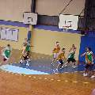

Next year I'll be [transferring](/Nominated-Transfer-Five-Stages-of-Grief/) to another school. With this change I've had cause to pause and consider what I've achieved with my time at my current school; what I've learnt and what I'm proud of. Here's a selection of highlights ...

[Names have been redacted to protect the innocent (and the guilty).]

# Teaching and Learning Achievements

# Technology Coordinator Achievements

# Extra-curricular Achievements
|Icon|Achievement|Unlock|
|---|---|---|
||**Encroacher** Enjoy many years of basketball coaching Bonus points for making it to the regional finals twice (2003, 2010) |**Unlocked: May 16, 2003 2:36pm** Thanks: Matt W, James H, Josh S, Joel J, Kiwat K, Mitchell D, Jaquille E, Emma A, Jordan I, Lachlan M, Kirstie S, Shara D for their dedication and captaincy Special Thanks: Jenny S for organising everything we needed|

Thanks to photo timestamps, emails, and file creation dates, most of these unlock times are accurate. Unfortunately some are only a best guess.

# Thanks

Thank you to the many staff and students who have helped me unlock these and other achievements. (If I missed anyone, my apologies; let me know and I'll update this post.)

I look forward to finding and unlocking many more achievements at my new school.