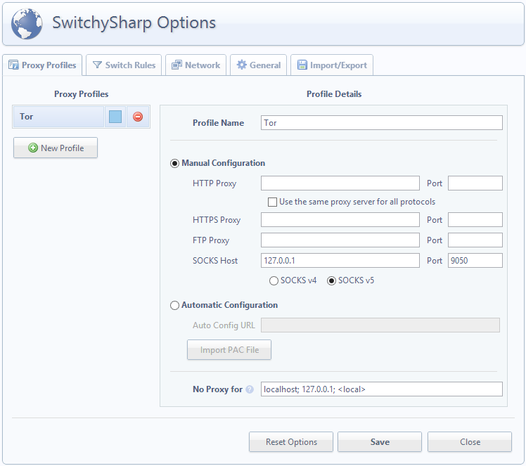
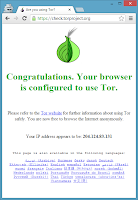

[Tor](https://www.torproject.org/) (The Onion Router) is free software and an open network intended to enable online anonymity. The default [browser bundle](https://www.torproject.org/download/download-easy.html.en) is the [ESR version](http://www.mozilla.org/en-US/firefox/organizations/) of Mozilla Firefox, which is good for privacy, but restricts functionality.

Security expert [Steve Gibson](https://www.grc.com/resume.htm) describes the benefits and structure of Tor in [Security Now 70](http://twit.tv/sn70). The official [Overview](https://www.torproject.org/about/overview.html.en) also outlines [Why We Need Tor](https://www.torproject.org/about/overview.html.en#whyweneedtor), and [How It Works](https://www.torproject.org/about/overview.html.en#thesolution). And [Wikipeida](http://en.wikipedia.org/wiki/Tor_(anonymity_network)) has a good summary or it's history, weaknesses, and legal issues.

The Tor Project [strongly encourages](https://www.torproject.org/docs/tor-doc-web) the use of the Tor Browser Bundle instead of configuring your own browser. But, if you really want to use Chrome the following steps should help.

1. Installation
    1. Follow standard procedure to [install Tor](https://www.torproject.org/download/download-easy.html.en)
    1. Follow standard procedure to [install Google Chrome](http://www.google.com.au/chrome) (if you haven't installed already)
1. Setup Tor
    1. Find the [Vidalia](https://www.torproject.org/projects/vidalia.html.en) application inside program folder *Tor Browser / App*
    1. Create a desktop or taskbar shortcut for the application (so you can start it easily or on [startup](http://www.eightforums.com/tutorials/5180-startup-items-manage-windows-8-a.html); Vidalia is the Tor client [GUI](https://en.wikipedia.org/wiki/Graphical_user_interface))
    1. Start Vidalia and ensure it can connect to the Tor network 
        * 
1. Setup Chrome
    1. Start Chrome and add the [Proxy SwitchySharp](https://chrome.google.com/webstore/detail/proxy-switchysharp/dpplabbmogkhghncfbfdeeokoefdjegm) extension (or [similar Proxy Switching](http://www.zeropaid.com/news/100849/top-5-proxy-chrome-extensions-for-anonymous-web-browsing/) extension; this will allow you to easily enable/disable Tor proxy)
        * 
1. Go to Proxy SwitchySharp Options and setup a Tor proxy profile using:
    1. Note: this is where this post differs from [some](http://wiki.answers.com/Q/How_do_you_configure_Google_Chrome_to_use_TOR) [others](https://plus.google.com/107077158029568553927/posts/K8fkvtX3Soy). You can confirm the settings required by reading [Tor's configuration documentation](https://www.torproject.org/docs/tor-doc-web), or by checking either Vidalia (Advanced Settings), or the Tor Browser (Firefox ESR) proxy settings.
1. Operation
    1. Start Vidalia (using your shortcut from Step 2b)
    1. Start Chrome and enable your Tor Proxy profile (and possibly go [Incognito](https://www.google.com/goodtoknow/manage-data/incognito-mode/))
    1. Check that Google Chrome is using Tor: [https://check.torproject.org/](https://check.torproject.org/)
        * 
    1. Browse with anonymity (just a bit slower)

If you appreciate or benefit from The Tor Project then maybe consider volunteering or donating. :-)

# Addendum

You can configure your Tor client to select which nodes it uses to enter and exit the Tor network. This is useful if you want your IP address to appear to be from a particular country; enabling you to stream content which is restricted to (or excluded from) certain locations. An outline of this configuration process can be found at the official [Tor Project FAQ](https://www.torproject.org/docs/faq#ChooseEntryExit), or for more detail search for "[tor exit country](https://www.google.com.au/search?q=tor+exit+country)".