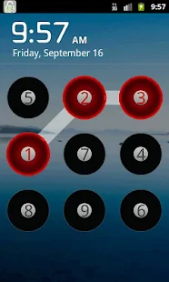

One problem with using pattern-lock to secure an Android device is that fingerprint residue on the screen can be used by an attacker to guess the pattern (AKA smudge attack).

So a really good idea would be for the unlock pattern to be different each time. By differentiating the matrix points as colours, numbers, or a mixture of other objects, the user needs to remember the sequence of points, and the pattern can be randomly created as required. (One interesting side-affect of the random matrix is that the pattern is device orientation independent, since it only depends on the order in which you join the dots.)

Discussing this with some work colleagues, they mentioned similar concepts implemented in door security panels, and other desktop software, but no mention of an Android security app. So I thought I might be onto something.

# Requirements

For the app to be useful I'd want three things before it could replace my current (default) lock screen app:

1. App locks the Android device on user action (timer or event), including internal storage
1. At user unlock request display a randomly generated pattern
1. If pattern is correct, unlock the device, else device remains locked

Sounds simple, but as of yet, I can't find an app that meets all three points. There are a couple that seem close:

## [Orbie Lock Screen](https://play.google.com/store/apps/details?id=com.qariapps.android.lockscreen)

This is a free Android app, which looked promising, but didn't actually lock the device's internal storage.

* **The Good:** Free, random unlock patterns; default matrix points are colours, but these can be upgraded to include sets of numbers, flags etc.; space for Owner Information
* **The Ugly:** Kind of looks like a 1980s Japanese game show, no clock format customisation
* **The Bad:**
    * It doesn't lock the device; sure it looks locked, but plug it into a computer with a USB cable, and the device's internal storage is wide open
    * The lock screen also leaks notification information; if you swipe down on the lock screen you can temporarily see the phone's notifications
    * Also, since the app takes over for the default Launcher, double-tap of the Home button does not function correctly, and some apps seem slow to load

## [Number Track Lock](https://play.google.com/store/apps/details?id=jp.jmon.matrixlockscreen)

Since I now knew what to look for, I specifically downloaded this AU$3.99 app with the idea of checking it out, and cancelling within the 15 minute refund period if it wasn't satisfactory. Once again, it seemed to work well, but did not lock the device's internal storage.

* **The Good:** Looks stylish, and works very smoothly; space for Owner Information
* **The Ugly:** No clock format customisation
* **The Bad:**
    * Once again the app does not lock the internal storage, an attacker can access the storage contents by simply connecting with a USB cable
    * The lock screen also leaks notification information; when you swipe down, all notifications appear indefinitely as if the device was not locked at all
    * Also, in the 15 minutes that I used the app, every time I unlocked, it always took me to the Number Track Lock options screen

# Summary

Although they both seem to have the right idea on preventing smudge attacks, neither of them locked the device internal storage.

I couldn't find any other apps that attempted to prevent smudge attacks. So the best solution at the moment is to install one of these (Orbie Lock Screen is free and works OK), AND keep the default security on as well (contrary to the instructions provided with both Orbie Lock Screen and Number Track Lock). This means swiping two patterns in order to unlock the device, which is acceptable (until something better comes along).

So:
1. Do you know of a good Android lock screen that uses random patterns and actually works?
1. If not, can you build one? (I only ask for 10% of sales :-)
1. If not, are you willing to be a tester if I ever get around to learning how to build Android apps?

# Update: 18-Feb-2014

I wish I had a happy update, but unfortunately things are worse than outlined above. I've continued to use Orbie with the Default pattern-lock; i.e. requiring two swipe patterns to unlock my Nexus 4. However, Orbie is not very stable, and can sometimes cause launcher lag.

The worst part is that when the phone is rebooted,it takes several seconds before Orbie to load. Without the Default pattern-lock the phone is wide open. The skill required to circumvent Orbie is "Reboot phone".

So, until pattern-lock is updated in the OS to include random patterns, be sure to include the Default lock as well. Sure it requires two unlocks, but at least you minimise smudge attack.
