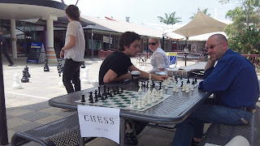

Chess is a fun game. And I've seen the benefits of the game produce great results for high school students. Benefits such as improved concentration, problem-solving, and self-control.

Since joining [chess.com](http://www.chess.com/members/view/Mr-Smiley) and regularly playing staff and students at work, I've been thinking about the benefits of chess; some of which are mentioned in [Josh Waitzkin's Academy](https://www.youtube.com/watch?v=Nn91D8f6-6c) from [Chessmaster](https://en.wikipedia.org/wiki/Chessmaster) 10th Edition.

I'm no expert (in life or chess), but here are some lessons I've gleaned:
1. **Look for a good move, look for a better move, look for the best move**
    * Chess example [61430328](http://www.chess.com/echess/game?id=61430328): **10.** Bg5 attacks black Queen on d8, and threatens N fork on c7 and Q+ on f7. Then **14.** Nf6+ could have also been **14.** Nc7+; which was the original threat, but I hoped to use the N to clear a way for the Q to attack.
    * Applicable when making life decisions; always consider your options, and seek wisdom and advice; take some time to consider the issue from a variety of perspectives, and make the best decision with the information you have.
1. **See the whole board**
    * Chess example [51448389](http://www.chess.com/echess/game?id=51448389): **24.** gxh4 is a bad move, clearing the g file for the black rooks to attack my king. While concentrating on the pawn count I wasn't thinking about a defensive structure.
    * Don't "miss the forest for the trees"; sometimes I focus so much on one problem that I don't see an alternate solution, or miss another pending problem. I find it good to *take a step back* ("sleep on it") and approach the problem anew with a fresh mind.
1. **Control the centre**
    * Chess example [60848416](http://www.chess.com/echess/game?id=56087480): The first 14 moves are primarily about controlling the centre of the board (d4-5; e4-5), and positioning pieces to attack the castled kings.
    * In life this is about *maintaining balanced self-control*. Sometimes there are side problems which can distract from your primary issues and goals; but by maintaining a perspective of what's really important (your centre), things are more likely to work out in your favour.
1. **Make each move count** (aka develop your pieces)
    * Chess example [56087480](http://www.chess.com/echess/game?id=56087480): The first 6 moves begin to develop Ns and Bs into the centre of the board. If possible you want to develop your pieces; each move honing your attack and strengthening your defense. A loss of [tempo](http://en.wikipedia.org/wiki/Tempo_(chess)) can result in an awkward situation.
    * *Make each day count:* meet someone new, go somewhere new, learn something new. Look for patterns, and apply what you learn. Explore knowledge, and gain wisdom; take advantage of new situations and expand your mind and skills.
1. **Own your blunders ...**
    * Chess example [62770100](http://www.chess.com/echess/game?id=62770100): After winning the [first tournament match](http://www.chess.com/echess/game?id=62066680) against this opponent I became over-confident and strutted the Queen out early. She was dead by the fifth move.
    * **... and learn from your mistakes.** It's [OK to fail](https://www.youtube.com/watch?v=FbOwTlHlQAs), to make mistakes. Remember those experiences and apply them to the next similar situation you encounter. 
1. **Cost Benefit Analysis**
    * Chess example [61020202](http://www.chess.com/echess/game?id=61020202): We both made blunders in this game, and I lose a B for free at **15.** Qxa2. But **17.** ... Nf4 helps set up the Q for a back-line trap with R.
    * *One good decision* can make the difference when the odds are against you.

And, as a former manager of a successful school chess team, I would add:

7. **Play with Integrity; Resign with Dignity**
    * Chess example [56900152](http://www.chess.com/echess/game?id=56900152): After **26.** ... bxc4 it turns into a pawn war. I lose tempo and black promotes to a Q. Once my pieces are captured it's time to admit defeat and gracefully resign. The greatest example of this in chess I know of is [Fischer vs Spassky (1972 Worlds Game 6)](https://www.chess.com/blog/DJAbacus/brilliant-games-1--making-history--fischer-vs-spassky-1972-game-6) where a stunned Spassky applauds Fischer's victory.
    * Play according to your life principles, and [accept the things you cannot change](https://en.wikipedia.org/wiki/Serenity_Prayer).
