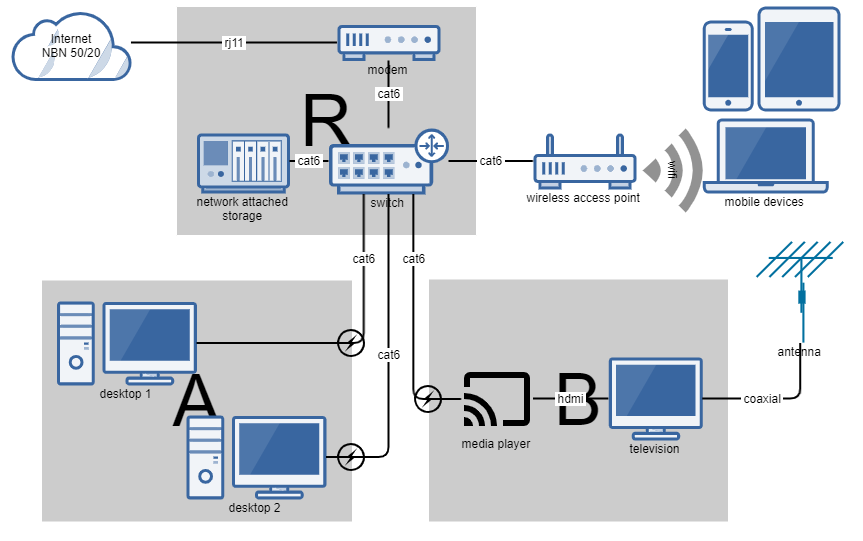

My home network has changed a bit since [2011](2011-11-13-Home-Network-King-of-My-Data-Castle.md). New devices, new technologies, and some electrical work has made things more reliable for Work From Home.

# NBN

First off, the [National Broadband Network](https://www.nbnco.com.au/) became available in my area in 2018. I got the maximum available for my residence at 50/20 Mbps, which has been fine for working from home via VPN/RDP, video conferenceing, and family TV 1080p streaming.

There were environmental factors which would cause connection drops (e.g. raining, temperature change), but these were all related to the aging house, and the twisted pair cabling from the original ADSL setup.

Call the electrician!

# Physical changes

Thanks to Kurt from [Peter Gow Electrical](https://www.petergowelectrical.com.au/) we rewired the phoneline from the curb to a new socket, removing all of the faulty twisted-pair cabling.

Additionally, data cabling was replaced, and new wall sockets were installed at multiple points; removing the need for switchs throughout the house.

# Network diagram

A lot of the network infrastructure was moved from the study/library (A) to a wall mounted network rack cabinet (R), and new data cabling was installed from the rack to the study (A) and media room (B).

The wireless access point serves multiple mobile devices throughout the house; and those devices can control the media player in the media room (B).

Backups of data/documents are scripted from desktop and mobile devices to the network attached storage (NAS). And the NAS can also be used for sharing data between devices (e.g. photos to media player).

The (R) switch can be used to segment the network into separate subnets, but is primarily used for DHCP.

And, as in 2011, this network diagram was constructed using <https://www.gliffy.com/>, and exported as a PNG for inclusion on this post.